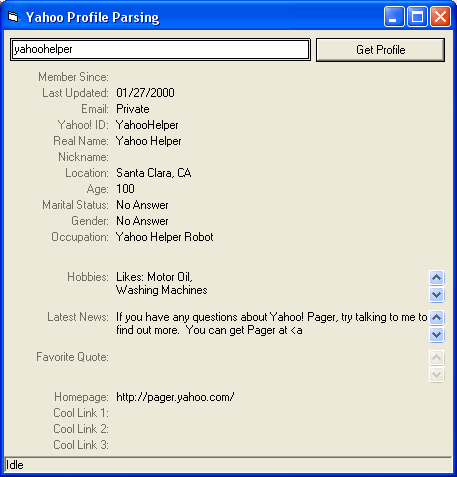



## \_ Yahoo Profile Parsing Routine \_

### Description

Routine I made to pull the infomation of a yahoo profile. (English) Most 'profilers' just connect to the profile page and display it. This will return the information with no need to display it. Vote if you like, thanks.
 
### More Info
 

             |
---                |---
**Submitted On**   |2003-11-28 15:02:26
**By**             |[KRYO\_11](https://github.com/Planet-Source-Code/PSCIndex/blob/master/ByAuthor/kryo-11.md)
**Level**          |Advanced
**User Rating**    |4.6 (32 globes from 7 users)
**Compatibility**  |VB 5\.0, VB 6\.0
**Category**       |[Internet/ HTML](https://github.com/Planet-Source-Code/PSCIndex/blob/master/ByCategory/internet-html__1-34.md)
**World**          |[Visual Basic](https://github.com/Planet-Source-Code/PSCIndex/blob/master/ByWorld/visual-basic.md)
**Archive File**   |[\_\_Yahoo\_Pr16773611282003\.zip](https://github.com/Planet-Source-Code/kryo-11-yahoo-profile-parsing-routine__1-50179/archive/master.zip)

